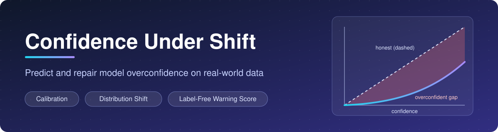
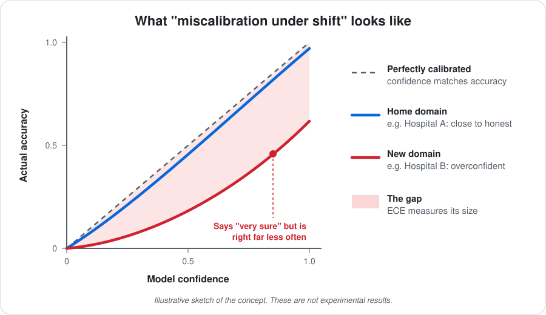
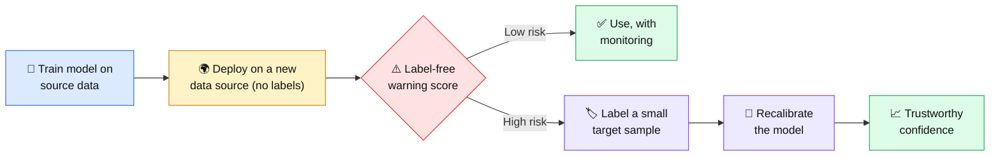
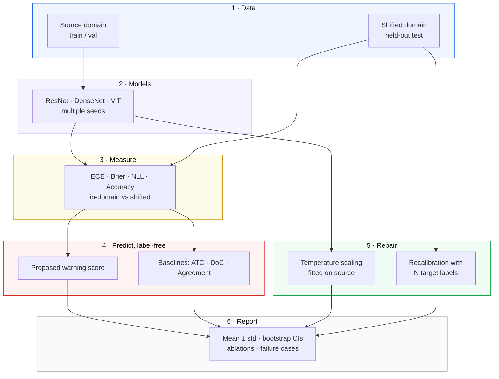
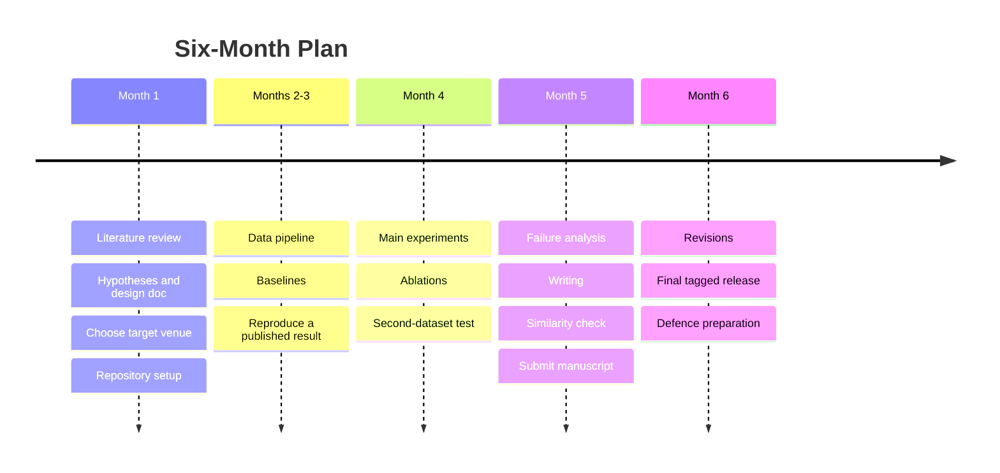
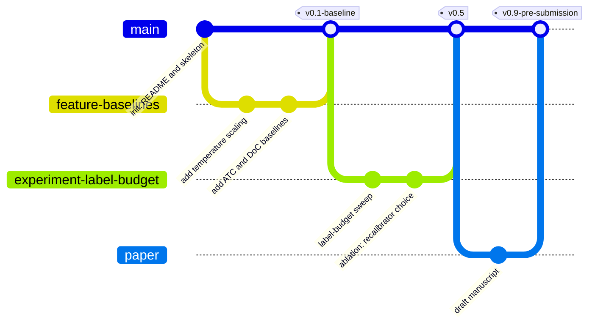

<div align="center">



<br>


**Can we predict when a model's confidence will fail on new real-world data, and how many labels does it take to repair it?**

[The Idea](#-the-idea-in-60-seconds) ·
[Research Question](#-research-question-and-hypotheses) ·
[Pipeline](#-experimental-pipeline) ·
[Getting Started](#-getting-started) ·
[Roadmap](#-roadmap) ·
[Team](#-team-and-git-workflow)

</div>

---

> [!NOTE]
> **Final-year Major Project (Research-Oriented)** · Dept. of CSE (Artificial Intelligence & Machine Learning) · Vasireddy Venkatadri Institute of Technology (VVIT).
> Evaluated under the department's *Research-Oriented Projects Evaluation Manual v1.0*.

> [!IMPORTANT]
> This project is at an **early stage**. There are no results yet. Every claim below is a hypothesis to be tested, and this README is updated as the work progresses, including failed and null results.

<details>
<summary><b>📑 Table of Contents</b></summary>

1. [The Idea in 60 Seconds](#-the-idea-in-60-seconds)
2. [Research Question and Hypotheses](#-research-question-and-hypotheses)
3. [Contributions](#-contributions)
4. [At a Glance](#-at-a-glance)
5. [Project Status](#-project-status)
6. [Experimental Pipeline](#-experimental-pipeline)
7. [Repository Structure](#-repository-structure)
8. [Getting Started](#-getting-started)
9. [Datasets](#-datasets)
10. [Models and Baselines](#-models-and-baselines)
11. [Experimental Protocol](#-experimental-protocol)
12. [Evaluation Metrics](#-evaluation-metrics)
13. [Results](#-results)
14. [Reproducibility](#-reproducibility)
15. [Ethics and Limitations](#-ethics-and-limitations)
16. [Roadmap](#-roadmap)
17. [Team and Git Workflow](#-team-and-git-workflow)
18. [Manuscript](#-manuscript)
19. [References](#-references)
20. [Citation](#-citation)
21. [License](#-license)

</details>

---

## 💡 The Idea in 60 Seconds

Think of an AI model as a student taking an exam.

- **Confidence** is how sure the student says they are: *"I'm 90% sure this is a tumor-free patch."*
- **Calibration** means that honesty holds up: across all answers given with 90% confidence, about 90% should be correct.
- **The problem:** the student studied with material from one place (Hospital A). At Hospital B the scanners and lighting differ. The student makes more mistakes but **still says "90% sure."** People trust the number, so this is dangerous.

<div align="center">

</div>

<br>

At a new site there are usually **no labels**, so nobody can simply check the answers. That leaves two practical questions:

| # | Question | What we build |
|---|----------|---------------|
| 1 | ⚠️ *Can we tell, without labels, that confidence is about to be wrong?* | A label-free **warning score** |
| 2 | 🔧 *If it is wrong, how many labeled examples do we need to fix it?* | A **label-budget curve** |



---

## 🎯 Research Question and Hypotheses

**Research question.** For a classifier moved to a new real-world data source, can a label-free score predict its calibration error, and how many target labels are needed to recover most of the lost calibration?

Hypotheses below are **provisional**. Thresholds will be frozen in `docs/design.md` *before* the main experiments run.

| ID | Hypothesis | Would be refuted if |
|----|------------|---------------------|
| **H1** | Temperature scaling fitted on source data leaves **at least 50%** of the shifted ECE gap unrecovered on real-world shift sets. | Source-fitted temperature scaling recovers most of the gap. |
| **H2** | A label-free score predicts shifted ECE with a **higher Spearman correlation than ATC and DoC**, with a paired-bootstrap 95% CI that excludes zero. | The score does no better than existing predictors. |
| **H3** | Recalibration on **100 or fewer** labeled target examples recovers **at least 80%** of the shifted ECE gap. | Far more labels are needed. |

> [!TIP]
> **A negative result is still a result.** "Label-free scores add nothing beyond confidence-based ones" or "you need thousands of labels" are useful findings for anyone deploying a model, and they will be reported as fully as positive ones.

---

## 🏆 Contributions

- **Measure** how source-fitted calibration fails under real-world shift, not only synthetic corruptions.
- **Propose and evaluate** a label-free predictor of shifted calibration error.
- **Report** a label-budget curve: number of target labels versus calibration recovered.
- **Release** an open-source tool and configs for checking calibration under shift.

> [!WARNING]
> Novelty is being verified against the literature in Month 1. Accuracy prediction under shift and calibration under shift are both active research areas. This list will be revised to reflect only what survives that check.

---

## 🔭 At a Glance

| | |
|---|---|
| **Field** | Trustworthy ML · Calibration · Distribution shift |
| **Task** | Image classification under real-world and controlled shift |
| **Data** | WILDS Camelyon17 · PACS · CIFAR-10-C |
| **Models** | ResNet-18/50 · DenseNet-121 · ViT-Small |
| **Compared against** | Temperature scaling · Deep ensembles · ATC · DoC · Agreement-based estimates |
| **Rigor** | 3-5 seeds · bootstrap CIs · ablations · second-dataset test |
| **Deliverables** | Paper submission · reproducible code · open-source tool |

---

## 🚦 Project Status

| Milestone | Status |
|-----------|:------:|
| Repository created | ✅ Done |
| Literature review and taxonomy | 🔄 In progress |
| Design document (`docs/design.md`) | ⬜ Not started |
| Data pipeline | ⬜ Not started |
| Baselines reproduced | ⬜ Not started |
| Main experiments and ablations | ⬜ Not started |
| Second-dataset generalization | ⬜ Not started |
| Manuscript drafted and submitted | ⬜ Not started |
| Tagged release linked from manuscript | ⬜ Not started |

*Legend: ✅ done · 🔄 in progress · ⬜ not started. Updated with each milestone.*

---

## 🧪 Experimental Pipeline



---

## 🗂️ Repository Structure

> Planned layout. Folders are added as the work reaches them.

```
confidence-under-shift/
├── README.md
├── LICENSE
├── requirements.txt          # pinned dependencies
├── assets/                   # README images
├── configs/                  # experiment configs: datasets, models, seeds, hyperparameters
├── data/                     # dataset download/prep scripts (raw data is not committed)
├── src/
│   ├── datasets/             # loaders and shift splits
│   ├── models/               # model definitions
│   ├── calibration/          # ECE, Brier, NLL, temperature scaling, recalibrators
│   ├── predictors/           # label-free predictors: proposed score, ATC, DoC, agreement
│   ├── attribution/          # Grad-CAM and shortcut-reliance measures
│   └── utils/
├── experiments/              # one run script per experiment
├── notebooks/                # exploration and figures
├── results/                  # logs, tables, figures (with the config that produced them)
├── tests/                    # sanity checks and unit tests
├── docs/
│   ├── design.md             # experimental design, written BEFORE main runs
│   ├── literature.md         # taxonomy and reading notes
│   └── experiment_log.md     # what was tried, including what failed
└── paper/                    # manuscript sources
```

---

## 🚀 Getting Started

### Prerequisites

- Python 3.10 or newer
- A GPU is recommended for training (the free tiers of Google Colab or Kaggle are enough for the planned scale)
- Git

### Installation

```bash
git clone https://github.com/patrator12/confidence-under-shift.git
cd confidence-under-shift

python -m venv .venv
source .venv/bin/activate        # Windows: .venv\Scripts\activate
pip install -r requirements.txt
```

### Running an experiment *(planned interface)*

```bash
# 1. Train a source model
python experiments/train.py --config configs/resnet18_pacs.yaml --seed 0

# 2. Evaluate calibration on the shifted domain
python experiments/evaluate.py --config configs/resnet18_pacs.yaml --seed 0

# 3. Compute the label-free predictor and compare against baselines
python experiments/predict_shift_ece.py --config configs/predictor_compare.yaml
```

> [!NOTE]
> These commands describe the intended interface. Scripts are added as they are implemented, and this section is updated at each milestone.

---

## 📦 Datasets

| Dataset | Role | Shift type |
|---------|------|-----------|
| **WILDS Camelyon17** | 🌍 Real-world case | Hospital-to-hospital shift in histopathology patches |
| **PACS** | 🎨 Controlled domain shift | Photo, art, cartoon, sketch |
| **CIFAR-10 / CIFAR-10-C** | 📉 Controlled, graded shift | Corruptions at multiple severities |
| **Waterbirds / Colored MNIST** *(optional)* | 🔍 Shortcut analysis | Spurious background or color correlation |

- Datasets are downloaded by scripts in `data/`. Raw data is never committed.
- WILDS datasets are accessed through the official [`wilds`](https://github.com/p-lambda/wilds) package.
- A subset may be used where compute limits require it. Any subsetting is documented in `docs/design.md` and in the paper.
- Data provenance, size, collection method, and known biases for each dataset are recorded in `docs/design.md`.

---

## 🤖 Models and Baselines

| Group | Methods |
|-------|---------|
| **Models** | ResNet-18 · ResNet-50 · DenseNet-121 · ViT-Small (pretrained, fine-tuned) |
| **Recalibration baselines** | Temperature scaling · Deep ensembles · Label smoothing · one more post-hoc method |
| **Label-free predictor baselines** | Average Thresholded Confidence (ATC) · Difference of Confidences (DoC) · Agreement-based estimates |

Baselines receive the **same tuning budget** as the proposed method.

---

## 🔬 Experimental Protocol

The full design is written in `docs/design.md` **before** the main experiments are run.

| Element | Plan |
|---------|------|
| **Independent variables** | Dataset and shift · model · source-fitted vs. target-labeled recalibration · label budget (10, 50, 100, 500, more) |
| **Dependent variables** | ECE · Brier · NLL · accuracy · correlation between predicted and observed calibration error |
| **Splits** | Fixed and leakage-checked. Recalibration data and evaluation data are disjoint. |
| **Seeds** | 3-5 per configuration, reported as mean ± std with bootstrap CIs |
| **Ablations** | Components of the proposed score · choice of recalibrator · label-budget size |
| **Sanity checks** | Shuffled labels give chance-level behavior · Grad-CAM weight-randomization test · one published number reproduced first |
| **Failure analysis** | At least one concrete failure case, with an explanation |

### ✅ Rigor checklist

- [ ] Design document written before main experiments
- [ ] Hypothesis thresholds frozen in advance
- [ ] Strong, recent baselines included, with equal tuning budget
- [ ] Train, calibration, and test data verified disjoint
- [ ] Multiple seeds with variance reported
- [ ] Ablation study completed
- [ ] Second dataset tested
- [ ] Failure case documented
- [ ] Negative and null results logged

---

## 📏 Evaluation Metrics

**Expected Calibration Error** compares confidence with accuracy inside confidence bins:

$$
\mathrm{ECE} = \sum_{b=1}^{B} \frac{|B_b|}{n}\,\bigl|\,\mathrm{acc}(B_b) - \mathrm{conf}(B_b)\,\bigr|
$$

| Metric | Why it is used |
|--------|----------------|
| **ECE** (fixed-bin and adaptive-bin) | Main calibration measure. It is sensitive to binning, so both variants are reported. |
| **Brier score** and **NLL** | Complementary measures that do not depend on binning. |
| **Spearman correlation** | How well predicted calibration error tracks observed calibration error. |
| **Recovery fraction** | Share of the shifted ECE gap closed by recalibration. |
| **Compute cost** | Training time, inference time, and parameter count per method. |

---

## 📊 Results

> [!IMPORTANT]
> **No results yet.** This section fills in as experiments complete, and will include failed and null results.

| Experiment | Dataset | Metric | Baseline | Ours | Seeds | Notes |
|-----------|---------|--------|----------|------|:-----:|-------|
| TBD | TBD | TBD | TBD | TBD | TBD | TBD |

---

## ♻️ Reproducibility

- Dependencies are pinned in `requirements.txt`.
- Seeds and hyperparameters live in `configs/` and are logged with every run.
- Each table and figure in `results/` is stored with the config and commit hash that produced it.
- A tagged release will match the exact code state behind the submitted manuscript (for example `v0.9-pre-submission`).
- Every experiment run is logged in `docs/experiment_log.md`, including those that did not support the hypotheses.

<details>
<summary><b>Hyperparameter table</b> (to be completed)</summary>

| Parameter | Value |
|-----------|-------|
| Optimizer | TBD |
| Learning rate | TBD |
| Batch size | TBD |
| Epochs | TBD |
| Seeds | TBD |

</details>

---

## ⚖️ Ethics and Limitations

- **No clinical use.** Camelyon17 is a public benchmark of histopathology patches. No new patient data is collected, and this work is not a medical device or decision tool.
- **Inherited bias.** Pretrained models may carry biases from their training data. This is disclosed where relevant.
- **Compute limits.** They may restrict dataset size and the number of runs. Any such limit is stated in the paper.
- **Grad-CAM limits.** Shortcut-reliance measures built on Grad-CAM are validated on a controlled setting where the true shortcut is known.
- **Scope.** Results may not generalize beyond the tested datasets, models, and shift types.

---

## 🗓️ Roadmap



---

## 👥 Team and Git Workflow

| Member | GitHub | Primary area |
|--------|--------|--------------|
| `<Name 1>` | `@<username1>` | `<area>` |
| `<Name 2>` | `@<username2>` | `<area>` |

**Advisor / Guide:** `<Name>`

**How we work**

- Every member commits under their **own** GitHub account.
- Significant work goes on feature branches and is merged through pull requests.
- Issues track experiments, bugs, and open questions, and act as a running research log.
- Commit messages say what changed and why, for example `add ATC baseline for PACS photo-to-sketch`.
- Releases are tagged at milestones.



*The graph above is an example of the intended workflow, not the real history.*

---

## 📝 Manuscript

| Field | Detail |
|-------|--------|
| **Target venue** | `<to be selected in Month 1>` |
| **Indexing verified against live list** | `<Scopus / UGC-CARE / WoS, date checked>` |
| **Submission status** | Not yet submitted |
| **Manuscript ID** | `<pending>` |
| **Similarity check** | `<tool and score, pending>` |
| **Code availability** | This repository, tagged release `<pending>` |

---

## 📚 References

Initial reading list. It will grow into a structured taxonomy in `docs/literature.md`.

1. Guo, C., Pleiss, G., Sun, Y., Weinberger, K. *On Calibration of Modern Neural Networks.* ICML 2017.
2. Ovadia, Y., et al. *Can You Trust Your Model's Uncertainty? Evaluating Predictive Uncertainty Under Dataset Shift.* NeurIPS 2019.
3. Minderer, M., et al. *Revisiting the Calibration of Modern Neural Networks.* NeurIPS 2021.
4. Garg, S., et al. *Leveraging Unlabeled Data to Predict Out-of-Distribution Performance.* ICLR 2022.
5. Guillory, D., et al. *Predicting with Confidence on Unseen Distributions.* ICCV 2021.
6. Jiang, Y., et al. *Assessing Generalization of SGD via Disagreement.* ICLR 2022.
7. Koh, P. W., et al. *WILDS: A Benchmark of in-the-Wild Distribution Shifts.* ICML 2021.
8. Geirhos, R., et al. *Shortcut Learning in Deep Neural Networks.* Nature Machine Intelligence 2020.
9. Adebayo, J., et al. *Sanity Checks for Saliency Maps.* NeurIPS 2018.
10. Selvaraju, R. R., et al. *Grad-CAM: Visual Explanations from Deep Networks via Gradient-Based Localization.* ICCV 2017.

---

## 📖 Citation

If you use this work, please cite it once the manuscript is available:

```bibtex
@misc{confidence_under_shift,
  title  = {Confidence Under Shift: Predicting and Repairing Calibration Failure on Real-World Data Sources},
  author = {<Author names>},
  year   = {<Year>},
  note   = {Code: https://github.com/<your-username>/confidence-under-shift}
}
```

## 📄 License

Released under the MIT License. See [LICENSE](LICENSE) for details. Datasets and pretrained models remain under their own licenses.

## 🙏 Acknowledgments

Guidance from `Dr.S.L.V.V.D.Sarma` and the Department of CSE (AI & ML), VVIT. Built on open-source tools including PyTorch and the WILDS benchmark.

<div align="center">

**If this project is useful to you, consider giving it a ⭐ once it is public.**

</div>
